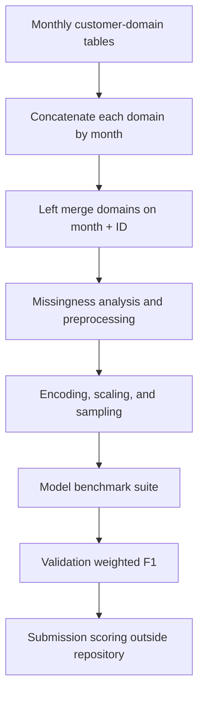

# Architecture

| Path | Responsibility |
|---|---|
| `src/baseline_xgb.py` | Multi-table loading/merging and an XGBoost baseline. |
| `src/missing_mechanism_analysis.py` | Portable CSV missingness summary CLI. |
| `src/train_eval_20k.py` | 20k sampling, preprocessing, and model evaluation cells. |
| `src/tabnet_experiments.py` | Portable TabNet benchmark CLI for sampled CSV inputs. |
| `src/project_config.py` | Environment-configured data and artifact paths for refactored core scripts. |
| `reports/실험요약.md` | Experiment and competition score summary. |

The repository does not include the underlying data or a maintained command-line
entry point. The flow is reconstructed from exported scripts and the retained
summary, not from a rerun.
